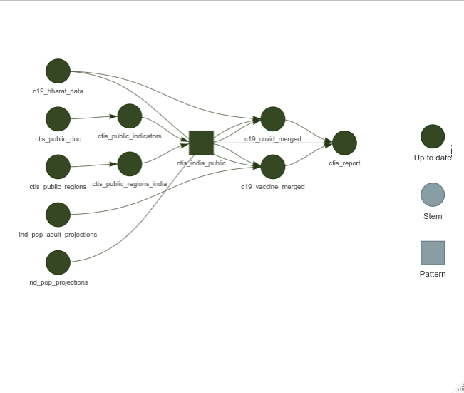

<!-- README.md is generated from README.Rmd. Please edit that file -->

```{r, include = FALSE}
knitr::opts_chunk$set(
  echo = TRUE, eval = FALSE,
  fig.width = 9, fig.height = 9,
  dpi = 320,
  collapse = TRUE,
  comment = "#>",
  fig.path = "man/figures/README-",
  out.width = "100%"
)
```

# CTIS Validation Analysis

This repository contains the documentation, results, and code of a project validating data from CTIS 

## Workflow

This analysis in this repository has been implemented using the [`targets`](https://docs.ropensci.org/targets/) package and associated packages. The workflow can be visualised as the following graph.


- Run the workflow sequentially.

```{r}
targets::tar_make()
```

- Run the workflow using all available workers.

```{r}
targets::tar_make_future(workers = future::availableCores())
```

- Explore a graph of the workflow.

```{r}
targets::tar_visnetwork(targets_only = TRUE)
```
