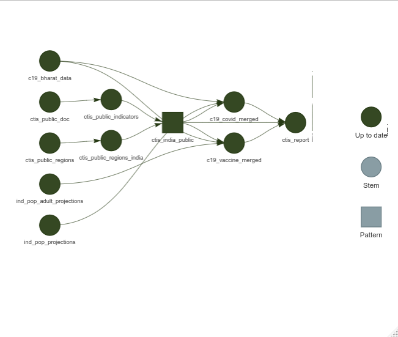

<!-- README.md is generated from README.Rmd. Please edit that file -->

# CTIS Validation Analysis

This repository contains the documentation, results, and code of a
project validating data from CTIS

## Workflow

This analysis in this repository has been implemented using the
[`targets`](https://docs.ropensci.org/targets/) package and associated
packages. The workflow can be visualised as the following graph.



-   Run the workflow sequentially.

``` r
targets::tar_make()
```

-   Run the workflow using all available workers.

``` r
targets::tar_make_future(workers = future::availableCores())
```

-   Explore a graph of the workflow.

``` r
targets::tar_visnetwork(targets_only = TRUE)
```
